# Plan: OSI Model Learning Platform

**Project Goal:** Develop a single-page, interactive learning platform about the OSI model, tailored for IT beginners. The platform will explain core concepts for each layer using simple text, metaphors, and engaging visuals.

**I. Overall Structure & Design:**

*   **Single-Page Application:** All 7 layers will be presented on a single HTML page, allowing users to scroll through them.
*   **Navigation:**
    *   A simple, sticky navigation bar at the top could allow users to jump to specific layers.
    *   Alternatively, "scroll spy" functionality could highlight the current layer in the navigation as the user scrolls.
*   **Visual Style:** Clean, modern, and visually appealing to keep beginners engaged. Use clear typography and a consistent color scheme.
*   **Layout:** Each layer will have a dedicated section with a consistent layout:
    *   Layer Number and Name
    *   Simple Explanation
    *   Metaphorical Explanation
    *   Key Functions (bullet points)
    *   Visual Element (animation, interactive diagram, or static image/Mermaid diagram)

**II. Content Plan per Layer (Core Concepts for IT Beginners):**

For each layer, we will simplify the provided text, focusing on:

1.  **Layer 1: Physical Layer (Bitübertragungsschicht)**
    *   **Explanation:** How raw bits (0s and 1s) are actually sent over a physical medium (cables, Wi-Fi).
    *   **Metaphor:** Like the postal service's trucks and roads that physically move letters, without knowing what's in them.
    *   **Key Functions:** Sending/receiving signals, defining physical characteristics (voltage, cable types).
    *   **Visual:** Animation of bits flowing through a cable, or different cable types (Ethernet, fiber optic).

2.  **Layer 2: Data Link Layer (Sicherungsschicht)**
    *   **Explanation:** Ensures data transfer between two directly connected nodes is reliable and organizes bits into frames.
    *   **Metaphor:** Like putting letters into envelopes with addresses for the next local post office and checking if the envelope arrived intact.
    *   **Key Functions:** Framing, physical addressing (MAC addresses), error detection.
    *   **Visual:** Animation of bits being grouped into a frame with a MAC address and a checksum. Interactive: click to see an error being detected.

3.  **Layer 3: Network Layer (Vermittlungsschicht)**
    *   **Explanation:** Responsible for routing packets across multiple networks to reach the final destination.
    *   **Metaphor:** Like the main postal sorting facility that decides the best route for your letter to travel across cities or countries.
    *   **Key Functions:** Logical addressing (IP addresses), routing, path determination.
    *   **Visual:** A simplified network map showing a packet taking a route from a source to a destination through routers. Mermaid diagram of a simple network.

4.  **Layer 4: Transport Layer (Transportschicht)**
    *   **Explanation:** Provides reliable and orderly data delivery between applications on different hosts. Manages connections.
    *   **Metaphor:** Like a registered mail service that ensures your entire package (all parts of it) arrives in the correct order and confirms delivery.
    *   **Key Functions:** Segmentation and reassembly, connection control (TCP), error recovery, flow control.
    *   **Visual:** Animation showing a large piece of data being broken into segments, sent, and reassembled. Show TCP handshake simply.

5.  **Layer 5: Session Layer (Sitzungsschicht)**
    *   **Explanation:** Manages and synchronizes conversations (sessions) between applications.
    *   **Metaphor:** Like a phone call operator who establishes the call, keeps it active, and ends it properly. Or a bookmark in a long conversation.
    *   **Key Functions:** Session establishment, maintenance, and termination; synchronization.
    *   **Visual:** Simple graphic showing two applications starting, maintaining, and ending a session. Perhaps a timeline with checkpoints.

6.  **Layer 6: Presentation Layer (Darstellungsschicht)**
    *   **Explanation:** Translates data into a format the application layer can understand. Handles encryption and compression.
    *   **Metaphor:** Like a translator who converts a letter from one language to another so the recipient can read it, or an encoder/decoder for secret messages.
    *   **Key Functions:** Data formatting, character encoding (e.g., ASCII to Unicode), encryption, compression.
    *   **Visual:** Animation showing data being "encrypted" (e.g., text turning into symbols) and then "decrypted." Or data being compressed (getting smaller).

7.  **Layer 7: Application Layer (Anwendungsschicht)**
    *   **Explanation:** Provides the interface for applications to access network services. What the user directly interacts with.
    *   **Metaphor:** Like the specific department at the post office you go to for a particular service (sending a parcel, buying stamps) or the application (email, web browser) you use.
    *   **Key Functions:** Provides network services to applications (e.g., web browsing, email, file transfer).
    *   **Visual:** Icons representing common applications (browser, email client) connecting to the network.

**III. Technical Implementation:**

*   **HTML (`index.html`):**
    *   Semantic HTML structure (e.g., `<header>`, `<nav>`, `<main>`, `<section>` for each layer, `<footer>`).
    *   Content placeholders for text and visuals.
*   **CSS (`style.css`):**
    *   Flexbox or CSS Grid for layout.
    *   Responsive design for different screen sizes.
    *   Styling for typography, colors, and interactive elements (hover effects, etc.).
*   **JavaScript (`script.js`):**
    *   Navigation interactivity (smooth scrolling, active state highlighting).
    *   Simple animations or interactive diagrams (if not using SVGs or external libraries for complex animations).
    *   Potentially, loading Mermaid diagrams if used.

**IV. Page Structure Diagram (Mermaid):**

```mermaid
graph TD
    A[index.html] --> B(Header: Title, Logo);
    A --> C(Navigation Bar: Links to Layers 1-7);
    A --> D(Main Content Area);
    D --> E(Layer 1 Section);
    E --> E1(Title: Physical Layer);
    E --> E2(Explanation Text);
    E --> E3(Metaphor Text);
    E --> E4(Visual: Animation/Diagram);
    D --> F(Layer 2 Section);
    F --> F1(Title: Data Link Layer);
    F --> F2(Explanation Text);
    F --> F3(Metaphor Text);
    F --> F4(Visual: Animation/Diagram);
    D --> G(Layer 3 Section);
    G --> G1(Title: Network Layer);
    G --> G2(Explanation Text);
    G --> G3(Metaphor Text);
    G --> G4(Visual: Animation/Diagram);
    D --> H(Layer 4 Section);
    H --> H1(Title: Transport Layer);
    H --> H2(Explanation Text);
    H --> H3(Metaphor Text);
    H --> H4(Visual: Animation/Diagram);
    D --> I(Layer 5 Section);
    I --> I1(Title: Session Layer);
    I --> I2(Explanation Text);
    I --> I3(Metaphor Text);
    I --> I4(Visual: Animation/Diagram);
    D --> J(Layer 6 Section);
    J --> J1(Title: Presentation Layer);
    J --> J2(Explanation Text);
    J --> J3(Metaphor Text);
    J --> J4(Visual: Animation/Diagram);
    D --> K(Layer 7 Section);
    K --> K1(Title: Application Layer);
    K --> K2(Explanation Text);
    K --> K3(Metaphor Text);
    K --> K4(Visual: Animation/Diagram);
    A --> L(Footer: Copyright, Links);

    %% Styling for sections
    classDef layerSection fill:#f9f,stroke:#333,stroke-width:2px;
    class E,F,G,H,I,J,K layerSection;
```

**V. Development Steps:**

1.  **Setup:** Create project folder with `index.html`, `style.css`, and `script.js`.
2.  **HTML Structure:** Build the basic HTML layout for the single page, including sections for each layer and the navigation.
3.  **CSS Basic Styling:** Apply initial CSS for layout, typography, and color scheme.
4.  **Content Population (Layer by Layer):**
    *   Start with Layer 1. Add the simplified explanation, metaphor, and key functions.
    *   Develop or integrate the visual element for Layer 1.
    *   Style the Layer 1 section.
    *   Repeat for Layers 2 through 7.
5.  **JavaScript Interactivity:** Implement navigation features (smooth scroll, active highlighting). Add any JS-based animations or interactions for the visuals.
6.  **Responsive Design:** Test and refine the layout for various screen sizes (desktop, tablet, mobile).
7.  **Testing:** Thoroughly test all content, visuals, and interactivity.
8.  **Refinement:** Make adjustments based on testing and feedback.